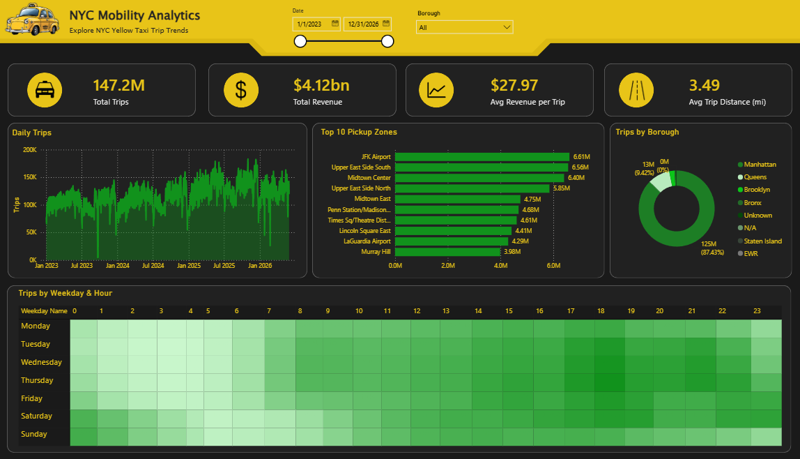
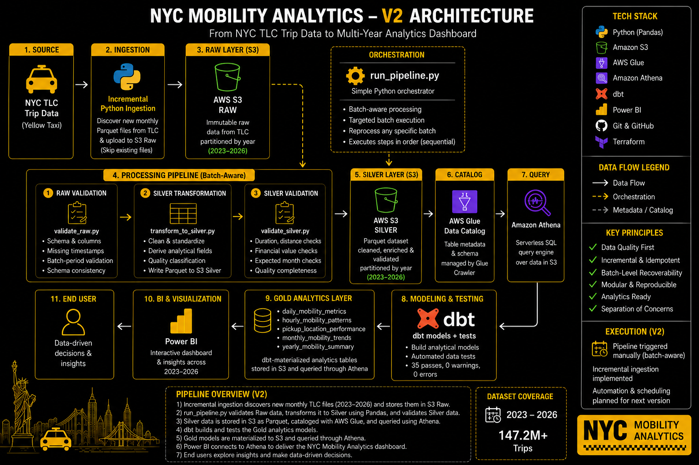

# 🚕 NYC Mobility Analytics

An end-to-end data engineering and analytics project processing **147+ million NYC Yellow Taxi trips from 2023–2026** into validated, analytics-ready datasets and an interactive Power BI dashboard.

The project covers the complete data lifecycle — from incremental ingestion and cloud storage to data quality validation, transformation, analytical modeling, testing, infrastructure as code, and business intelligence.



---

## Project Overview

NYC Mobility Analytics was built to answer a simple question:

> **How can large-scale public mobility data be transformed into reliable, decision-ready analytics?**

Monthly NYC Yellow Taxi trip data is incrementally ingested into Amazon S3, validated, and transformed into a cleaned Silver layer using Python and Pandas.

The pipeline processes data at the monthly batch level, allowing newly published TLC files to be added without reprocessing historical data. Individual batches can also be reprocessed and validated independently when required.

The data is cataloged with AWS Glue and queried through Amazon Athena. dbt builds and tests the Gold analytics layer, which powers an interactive Power BI dashboard for exploring mobility patterns, revenue, demand, pickup activity, and year-over-year trends.

The project follows a layered **Raw → Silver → Gold** architecture with explicit data quality controls between stages.

---

## Architecture



```text
NYC TLC Trip Data
        │
        ▼
Incremental Python Ingestion
        │
        ▼
Amazon S3 — Raw
        │
        ▼
Raw Validation
        │
        ▼
Python / Pandas Transformation
        │
        ▼
Silver Validation
        │
        ▼
Amazon S3 — Silver (Parquet)
        │
        ▼
AWS Glue Data Catalog
        │
        ▼
Amazon Athena
        │
        ▼
dbt — Modeling & Testing
        │
        ▼
Gold Analytics Layer
        │
        ▼
Power BI


Infrastructure as Code
        │
        ▼
Terraform
        │
        ├── Amazon S3
        ├── AWS Glue Data Catalog
        ├── AWS Glue Crawler
        └── IAM
```

---

## Data Pipeline

### Incremental Ingestion

Monthly NYC Yellow Taxi Parquet files are ingested from the NYC Taxi & Limousine Commission dataset and uploaded to the Raw layer in Amazon S3.

```text
src/ingestion/ingest_to_s3.py
```

The ingestion process is incremental. Existing Raw files are detected before processing so that newly available monthly batches can be added without unnecessarily downloading or overwriting historical data.

A separate TLC ingestion utility supports retrieving specific source batches when targeted ingestion or reprocessing is required.

```text
src/ingestion/ingest_from_tlc.py
```

Raw data is preserved without business transformations to provide a reproducible source layer.

### Raw Validation

Raw batches are validated before transformation.

Checks include:

- Required and unexpected columns
- Schema consistency
- Missing pickup timestamps
- Missing dropoff timestamps
- Expected batch-period validation

Validation is batch-aware, allowing individual monthly files to be checked independently.

A failed validation stops downstream processing for the affected batch.

### Silver Transformation

Validated Raw data is transformed using **Python, Pandas, and PyArrow**.

The transformation cleans and standardizes the source data, derives analytical fields, applies explicit quality classifications, and writes Parquet data to the Silver layer in S3.

```text
src/transformation/transform_to_silver.py
```

Silver processing is incremental. Raw files already represented in Silver are skipped during normal processing, while specific batches can be deliberately reprocessed when required.

### Silver Validation

Silver data is validated across several quality dimensions, including:

- Trip duration
- Trip distance
- Financial values
- Expected source period
- Required analytical fields

Source anomalies are classified rather than automatically discarded, preserving source information while making data quality explicit.

Date-quality validation is aware of the expected monthly batch period. Records falling outside the expected month can therefore be identified even when they remain within the same calendar year.

The quality rules are documented in:

```text
docs/data_quality_contract.md
```

### Catalog & Query

Silver Parquet data is cataloged through **AWS Glue Data Catalog** and queried using **Amazon Athena**, providing a serverless SQL interface over data stored in S3.

Partitioned multi-year data allows Athena to query the expanded dataset while retaining the underlying year-based S3 organization.

### Gold Modeling

dbt builds and tests the analytical Gold layer.

| Model | Purpose |
|---|---|
| `daily_mobility_metrics` | Daily trip volume, revenue, distance, duration, and quality KPIs |
| `hourly_mobility_patterns` | Weekday and hourly demand patterns |
| `pickup_location_performance` | Pickup activity by taxi zone and borough |
| `monthly_mobility_trends` | Monthly mobility KPIs for year-over-year trend analysis |
| `yearly_mobility_summary` | Year-level trip, revenue, distance, and duration summaries |

The V2 dbt build completes successfully with **35 passes, 0 warnings, and 0 errors**.

---

## Power BI Dashboard

The Gold models power an interactive Power BI dashboard covering the full multi-year dataset.

The dashboard contains:

- Total Trips
- Total Revenue
- Average Revenue per Trip
- Average Trip Distance
- Daily trip trends
- Top 10 pickup zones
- Trips by borough
- Weekday × hour demand heatmap
- Date filtering across the multi-year dataset
- Borough filtering

The dashboard is connected to the AWS analytics layer through Amazon Athena.

Filters allow the same analytical views to be explored across different time periods and boroughs without changing the underlying models.

---

## Dataset

V2 expands the analytical dataset from the original 2025 implementation to a multi-year dataset covering:

```text
2023
2024
2025
2026
```

The resulting analytics layer contains approximately **147.2 million Yellow Taxi trips**.

The pipeline is designed so that additional monthly TLC batches can be incorporated incrementally as new source data becomes available.

---

## Key Findings

Analysis of the expanded dataset highlights several recurring mobility patterns:

- NYC Yellow Taxi activity shows clear recurring daily, weekly, and seasonal demand patterns across the dataset.

- Manhattan accounts for the majority of analyzed pickup activity, while Queens represents the second-largest share.

- High-volume pickup locations are concentrated in Manhattan, with major transportation hubs such as JFK and LaGuardia also appearing among the busiest zones.

- Evening hours consistently represent some of the highest-demand periods across weekdays.

- Weekend demand follows a different hourly profile from weekday demand, with stronger activity during late-night and early-morning hours.

- Monthly trip volumes vary substantially across both months and years, making year-over-year comparison useful for identifying broader mobility trends.

The Power BI dashboard allows these patterns to be explored dynamically across the available date range and boroughs.

---

## Orchestration

V2 uses a lightweight Python orchestrator:

```text
src/orchestration/run_pipeline.py
```

The orchestrator coordinates the core batch-processing stages sequentially:

```text
Raw Validation
      ↓
Silver Transformation
      ↓
Silver Validation
```

Each step must complete successfully before the next begins.

The workflow supports batch-level execution, making it possible to process and validate individual monthly source files rather than rerunning the entire historical dataset.

The intentionally simple orchestration reflects the current linear workflow without introducing unnecessary infrastructure.

More advanced orchestration will only be introduced when requirements such as multiple independent workflows, scheduling dependencies, retries, or conditional execution justify it.

---

## Infrastructure as Code

Core AWS infrastructure is managed using **Terraform**, providing a reproducible and version-controlled definition of the project's cloud resources.

Terraform currently manages:

- Amazon S3 storage
- AWS Glue Data Catalog databases
- AWS Glue Crawler
- IAM role and crawler permissions

Existing AWS resources were imported into Terraform state and reconciled with the infrastructure configuration. `terraform plan` is used to detect configuration drift and verify that the deployed AWS environment matches the declared infrastructure.

Infrastructure definitions are located in:

```text
infrastructure/
```

Future infrastructure changes to Terraform-managed resources are made through Terraform rather than manually through the AWS Console.

---

## Data Quality

Data quality is treated as part of the pipeline rather than as a final cleanup step.

```text
Raw
 │
 ├── Schema & completeness validation
 ├── Batch-period validation
 ▼
Silver Transformation
 │
 ├── Semantic quality classification
 ▼
Silver Validation
 │
 ├── Batch-aware validation
 ▼
dbt Gold Models
 │
 ├── Automated tests
 ▼
Analytics
```

The project follows a **preserve source truth** approach: unusual source values are investigated and classified before deciding whether they should be excluded from analysis.

Quality classifications include checks around:

- Temporal validity
- Expected source period
- Trip distance
- Financial values
- Source-specific semantics

This separates source anomalies from pipeline failures and allows downstream analytics to make explicit decisions about which records should contribute to individual metrics.

---

## Tech Stack

| Area | Technology |
|---|---|
| Language | Python |
| Data Processing | Pandas, PyArrow |
| Cloud | AWS |
| Storage | Amazon S3 |
| Data Catalog | AWS Glue Data Catalog |
| Query Engine | Amazon Athena |
| Analytics Engineering | dbt |
| Infrastructure as Code | Terraform |
| BI & Visualization | Power BI |
| Data Format | Apache Parquet |
| Version Control | Git & GitHub |

---

## Project Structure

```text
mobility-project/
│
├── dbt/
│   └── nyc_mobility/
│       ├── models/gold/
│       ├── seeds/
│       └── tests/
│
├── docs/
│   ├── architecture.png
│   ├── data_quality_contract.md
│   └── nyc_dashboard1.jpg
│
├── infrastructure/
│   ├── crawler.tf
│   ├── glue.tf
│   ├── iam.tf
│   ├── main.tf
│   └── s3.tf
│
├── scripts/
│
├── src/
│   ├── ingestion/
│   ├── investigations/
│   ├── observability/
│   ├── orchestration/
│   ├── transformation/
│   └── validation/
│
├── .gitignore
├── requirements.txt
└── README.md
```

Raw and generated datasets are excluded from version control.

---

## Running the Project

### Requirements

- Python
- AWS credentials with access to the required S3, Glue, and Athena resources
- Terraform
- Power BI Desktop for dashboard development

### Setup

```bash
git clone <repository-url>
cd mobility-project
python -m venv .venv
pip install -r requirements.txt
```

On Windows:

```powershell
.venv\Scripts\Activate.ps1
```

### Provision infrastructure

Terraform manages the core AWS infrastructure used by the project.

```bash
cd infrastructure
terraform init
terraform plan
```

Review the execution plan before applying infrastructure changes:

```bash
terraform apply
```

Return to the project root before running the data pipeline.

### Run ingestion

Run the standard incremental ingestion process:

```bash
python src/ingestion/ingest_to_s3.py
```

Specific TLC batches can also be ingested when targeted processing or recovery is required.

### Run the processing pipeline

```bash
python src/orchestration/run_pipeline.py
```

The processing components also support targeted batch execution for individual monthly files.

### Build and test Gold models

```bash
cd dbt/nyc_mobility
dbt build
```

Gold models can then be queried through Amazon Athena and consumed by Power BI.

---

## Design Principles

- **Data Quality First** — validation is built into the pipeline.

- **Preserve Source Truth** — anomalies are investigated and classified rather than silently removed.

- **Incremental Processing** — new source batches are processed without unnecessarily reprocessing historical data.

- **Idempotent Pipeline Behavior** — already processed batches are detected and skipped during normal execution.

- **Batch-Level Recoverability** — individual monthly batches can be independently ingested, transformed, validated, and reprocessed.

- **Separation of Concerns** — ingestion, validation, transformation, modeling, infrastructure, and visualization have distinct responsibilities.

- **Infrastructure as Code** — core AWS infrastructure is declared and version-controlled using Terraform.

- **Keep Complexity Justified** — additional infrastructure is introduced when a concrete problem requires it.

---

## Version History

### V1 — End-to-End Foundation ✅

V1 established the first complete path from NYC TLC source data to analytics.

Key capabilities included:

- 2025 Yellow Taxi dataset
- Amazon S3 Raw and Silver layers
- Python/Pandas transformation
- Raw and Silver validation
- AWS Glue Data Catalog
- Amazon Athena
- dbt Gold models
- Terraform-managed AWS infrastructure
- Power BI dashboard

### V2 — Incremental Multi-Year Pipeline & Analytics ✅

V2 expands the original pipeline into a more robust incremental multi-year system.

Key improvements include:

- Dataset expanded from 2025 to **2023–2026**
- Approximately **147.2 million trips**
- Incremental monthly ingestion
- Detection and skipping of previously processed files
- Batch-level pipeline execution
- Targeted batch reprocessing
- Month-aware data-quality validation
- Expanded Silver validation
- Multi-year Athena querying
- New monthly and yearly dbt Gold models
- Expanded dbt test coverage to **35 passing tests**
- Multi-year Power BI filtering
- Updated and polished Power BI dashboard

---

## Future Development

V2 establishes a validated, incremental, multi-year analytical pipeline.

Future versions can focus on operationalizing the system further as concrete requirements emerge.

Potential next steps include:

- Automated scheduled pipeline execution
- Cloud-based execution independent of a local development machine
- Pipeline monitoring and operational observability
- Failure handling and retry behavior
- Automated discovery and processing of newly published TLC batches
- Benchmarking processing performance as data volume grows
- Evaluating distributed processing if single-machine processing becomes a bottleneck
- Expanding Terraform coverage as the AWS architecture evolves

More advanced orchestration will be evaluated when the workflow develops requirements that justify it, such as multiple jobs with different schedules, dependencies, retries, or conditional execution.

Technology choices will continue to be driven by concrete requirements rather than added solely for architectural complexity.

---

## Data Source

Trip data is sourced from the public **NYC Taxi & Limousine Commission (NYC TLC) Trip Record Data**.

---

## Status

**V2 — Complete ✅**

V2 delivers an incremental multi-year data platform covering approximately **147.2 million NYC Yellow Taxi trips from 2023–2026**, with batch-aware ingestion and validation, cloud storage, analytical modeling, automated testing, infrastructure as code, and an interactive Power BI analytics layer.

The next phase will focus on operationalizing pipeline execution so that new data can be discovered, processed, validated, modeled, and surfaced with less manual intervention.