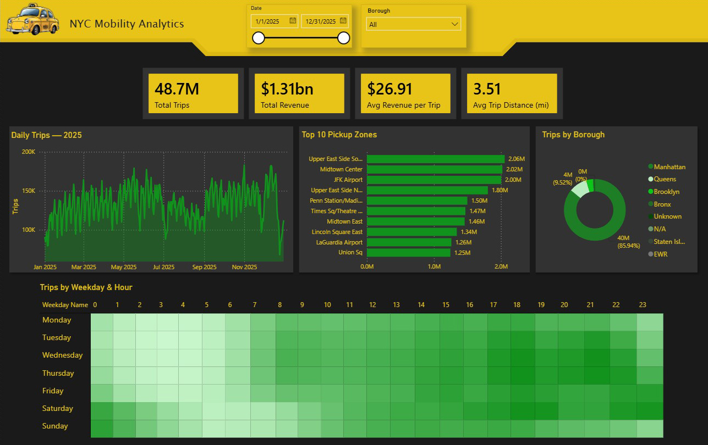
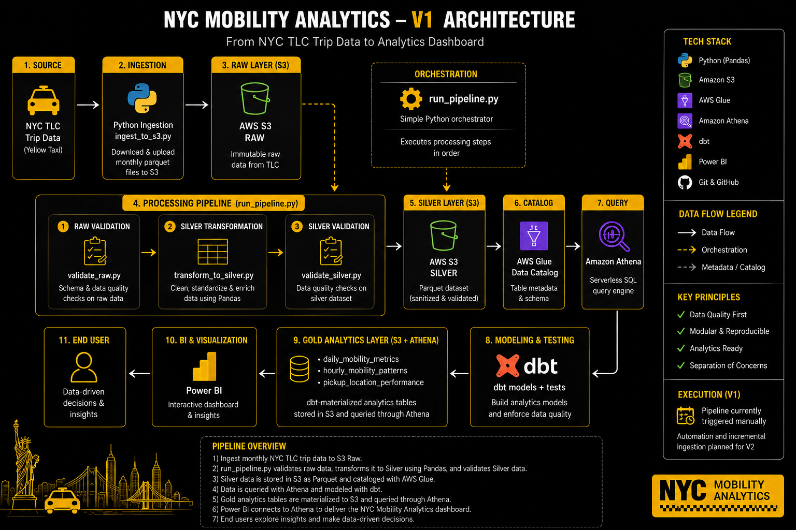

# 🚕 NYC Mobility Analytics

An end-to-end data engineering and analytics project processing **48.7 million NYC Yellow Taxi trips from 2025** into validated, analytics-ready datasets and an interactive Power BI dashboard.

The project covers the complete data lifecycle — from ingestion and cloud storage to data quality validation, transformation, analytical modeling, testing, and business intelligence.



---

## Project Overview

NYC Mobility Analytics was built to answer a simple question:

> **How can large-scale public mobility data be transformed into reliable, decision-ready analytics?**

Monthly NYC Yellow Taxi trip data is ingested into Amazon S3, validated, and transformed into a cleaned Silver layer using Python and Pandas.

The data is cataloged with AWS Glue and queried through Amazon Athena. dbt builds and tests the Gold analytics layer, which powers an interactive Power BI dashboard for exploring mobility patterns, revenue, demand, and pickup activity.

The project follows a layered **Raw → Silver → Gold** architecture with explicit data quality controls between stages.

---

## Architecture



```text
NYC TLC Trip Data
        │
        ▼
Python Ingestion
        │
        ▼
Amazon S3 — Raw
        │
        ▼
Raw Validation
        │
        ▼
Python / Pandas Transformation
        │
        ▼
Silver Validation
        │
        ▼
Amazon S3 — Silver (Parquet)
        │
        ▼
AWS Glue Data Catalog
        │
        ▼
Amazon Athena
        │
        ▼
dbt — Modeling & Testing
        │
        ▼
Gold Analytics Layer
        │
        ▼
Power BI
```

---

## Data Pipeline

### Ingestion

Monthly NYC Yellow Taxi Parquet files are ingested from the NYC Taxi & Limousine Commission dataset and uploaded to the Raw layer in Amazon S3.

```text
src/ingestion/ingest_to_s3.py
```

Raw data is preserved without business transformations to provide a reproducible source layer.

### Raw Validation

Raw batches are validated before transformation.

Checks include:

- Required and unexpected columns
- Schema consistency
- Missing pickup timestamps
- Missing dropoff timestamps

A failed validation stops downstream processing.

### Silver Transformation

Validated Raw data is transformed using **Python, Pandas, and PyArrow**.

The transformation cleans and standardizes the source data, derives analytical fields, applies explicit quality classifications, and writes Parquet data to the Silver layer in S3.

```text
src/transformation/transform_to_silver.py
```

### Silver Validation

Silver data is validated across several quality dimensions, including:

- Trip duration
- Trip distance
- Financial values

Source anomalies are classified rather than automatically discarded, preserving source information while making data quality explicit.

The quality rules are documented in:

```text
docs/data_quality_contract.md
```

### Catalog & Query

Silver Parquet data is cataloged through **AWS Glue Data Catalog** and queried using **Amazon Athena**, providing a serverless SQL interface over data stored in S3.

### Gold Modeling

dbt builds and tests the analytical Gold layer.

| Model | Purpose |
|---|---|
| `daily_mobility_metrics` | Daily trip volume, revenue, and mobility KPIs |
| `hourly_mobility_patterns` | Weekday and hourly demand patterns |
| `pickup_location_performance` | Pickup activity by taxi zone and borough |

The final V1 dbt build completed successfully with **19 passes, 0 warnings, and 0 errors**.

---

## Power BI Dashboard

The Gold models power an interactive Power BI dashboard containing:

- Total Trips
- Total Revenue
- Average Revenue per Trip
- Average Trip Distance
- Daily trip trends
- Top 10 pickup zones
- Trips by borough
- Weekday × hour demand heatmap
- Date and borough filtering

---

## Key Findings

Analysis of the 2025 dataset produced several notable findings:

- **48.72M trips** represented approximately **$1.31B in reported revenue**, averaging **$26.91 per trip** and **3.51 miles per trip**.
- **Saturday** was the busiest weekday with **15.75%** of trips, while **Monday** was the quietest at **12.18%**.
- The highest-volume recurring weekday/hour combination was **Thursday at 18:00**, with approximately **487K trips** across the year.
- **Manhattan accounted for 85.94%** of analyzed pickup activity, followed by Queens at 9.52%.
- **Upper East Side South** was the busiest pickup zone with approximately **2.06M trips**. Eight of the ten busiest zones were in Manhattan; the other two were JFK and LaGuardia airports.
- **May** recorded the highest trip volume at approximately **4.59M trips**, while **December** generated the highest monthly revenue at approximately **$132.9M**.

---

## Orchestration

V1 uses a lightweight Python orchestrator:

```text
src/orchestration/run_pipeline.py
```

It executes the core processing stages sequentially:

```text
Raw Validation
      ↓
Silver Transformation
      ↓
Silver Validation
```

Each step must complete successfully before the next begins.

The intentionally simple orchestration reflects the current linear workflow without introducing unnecessary infrastructure.

---

## Data Quality

Data quality is treated as part of the pipeline rather than as a final cleanup step.

```text
Raw
 │
 ├── Schema & completeness validation
 ▼
Silver Transformation
 │
 ├── Semantic quality classification
 ▼
Silver Validation
 │
 ▼
dbt Gold Models
 │
 ├── Automated tests
 ▼
Analytics
```

The project follows a **preserve source truth** approach: unusual source values are investigated and classified before deciding whether they should be excluded from analysis.

---

## Tech Stack

| Area | Technology |
|---|---|
| Language | Python |
| Data Processing | Pandas, PyArrow |
| Cloud | AWS |
| Storage | Amazon S3 |
| Data Catalog | AWS Glue Data Catalog |
| Query Engine | Amazon Athena |
| Analytics Engineering | dbt |
| BI & Visualization | Power BI |
| Data Format | Apache Parquet |
| Version Control | Git & GitHub |

---

## Project Structure

```text
mobility-project/
│
├── dbt/
│   └── nyc_mobility/
│       ├── models/gold/
│       ├── seeds/
│       └── tests/
│
├── docs/
│   ├── architecture.png
│   ├── data_quality_contract.md
│   └── nyc_dashboard.jpg
│
├── scripts/
│
├── src/
│   ├── ingestion/
│   ├── investigations/
│   ├── observability/
│   ├── orchestration/
│   ├── transformation/
│   └── validation/
│
├── .gitignore
├── requirements.txt
└── README.md
```

Raw and generated datasets are excluded from version control.

---

## Running the Project

### Requirements

- Python
- AWS credentials with access to the required S3, Glue, and Athena resources
- Power BI Desktop for dashboard development

### Setup

```bash
git clone <repository-url>
cd mobility-project

python -m venv .venv
pip install -r requirements.txt
```

On Windows:

```powershell
.venv\Scripts\Activate.ps1
```

### Run ingestion

```bash
python src/ingestion/ingest_to_s3.py
```

### Run the processing pipeline

```bash
python src/orchestration/run_pipeline.py
```

### Build and test Gold models

```bash
cd dbt/nyc_mobility
dbt build
```

Gold models can then be queried through Amazon Athena and consumed by Power BI.

---

## Design Principles

- **Data Quality First** — validation is built into the pipeline.
- **Preserve Source Truth** — anomalies are investigated and classified rather than silently removed.
- **Separation of Concerns** — ingestion, validation, transformation, modeling, and visualization have distinct responsibilities.
- **Keep Complexity Justified** — additional infrastructure is introduced when a concrete problem requires it.

---

## Future Development

V1 establishes the end-to-end pipeline and analytical product for the 2025 dataset.

Future versions will focus on:

- Expanding and backfilling the dataset
- Benchmarking processing performance as data volume grows
- Evaluating distributed processing when single-machine processing becomes a bottleneck
- Automating execution as scheduling and orchestration requirements grow
- Improving infrastructure reproducibility as the architecture evolves

Technology choices will continue to be driven by concrete requirements rather than added solely for architectural complexity.

---

## Data Source

Trip data is sourced from the public **NYC Taxi & Limousine Commission (NYC TLC) Trip Record Data**.

---

## Status

**V1 — Complete ✅**

The first version delivers an end-to-end path from public source data to validated cloud storage, analytical models, automated tests, and an interactive BI dashboard.