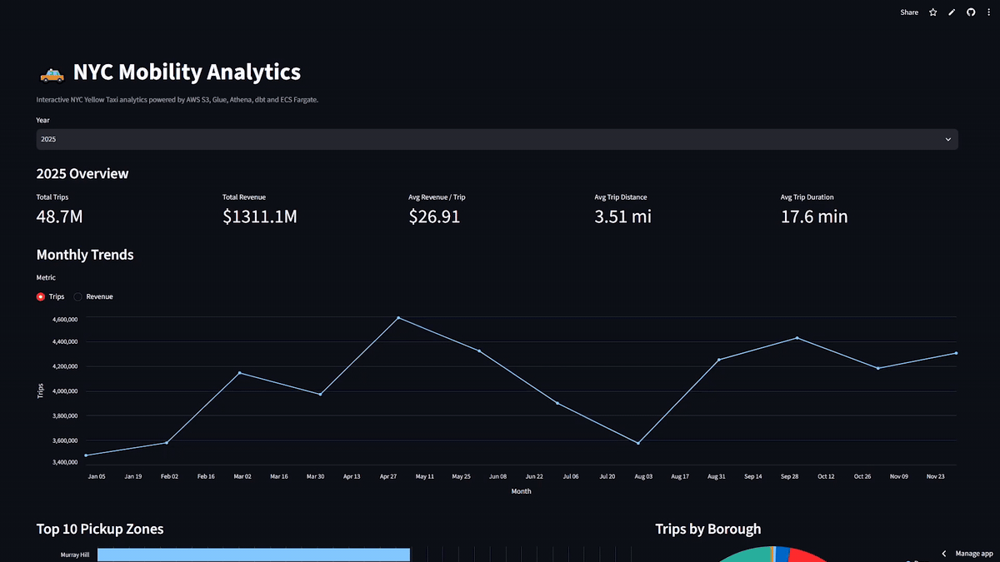
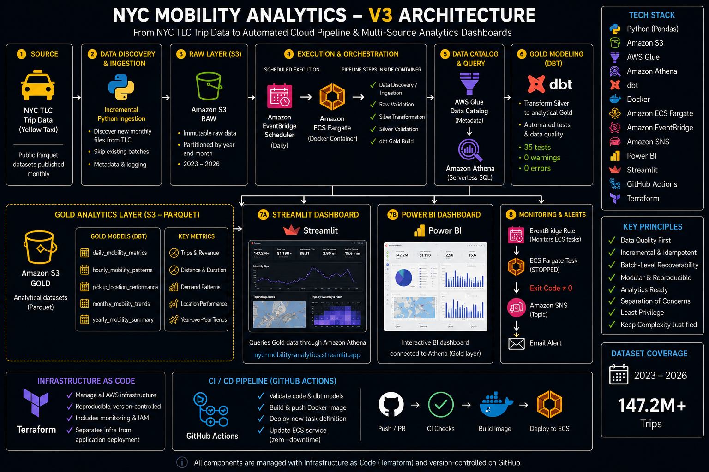
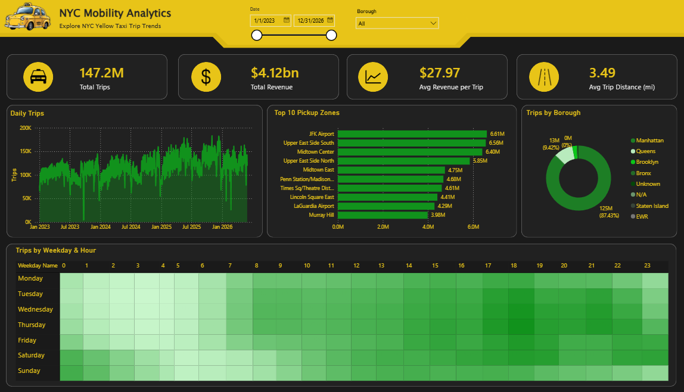

# 🚕 NYC Mobility Analytics

An end-to-end cloud data engineering project that processes **147+ million NYC Yellow Taxi trips from 2023–2026** into validated, analytics-ready datasets and interactive dashboards.

The platform incrementally discovers and processes newly published monthly data, runs automatically in AWS, builds tested analytical models with dbt, and exposes the results through both Power BI and a public Streamlit application.

## 🌐 Live Dashboard

**Streamlit:** https://nyc-mobility-analytics.streamlit.app

The live dashboard provides interactive access to the Gold analytics layer through Amazon Athena.



---

## Architecture



Pipeline execution is containerized with Docker and runs as an **ECS Fargate task**, triggered automatically by **Amazon EventBridge Scheduler**.

Infrastructure is provisioned with **Terraform**, while **GitHub Actions** provides CI/CD for validation and deployment.

Failed ECS tasks are detected by **EventBridge** and published through **Amazon SNS** as email alerts.

---

## Data Pipeline

### Incremental Ingestion

Monthly NYC Yellow Taxi Parquet files are discovered from the NYC Taxi & Limousine Commission dataset and uploaded to the Raw layer in Amazon S3.

The ingestion process is incremental:

- Newly published monthly batches are detected automatically
- Existing Raw files are skipped
- Historical data is not unnecessarily downloaded or overwritten
- Individual batches can be reprocessed when required

Raw source data is preserved without business transformations to maintain a reproducible source layer.

### Validation & Silver Transformation

Raw batches are validated before processing, including checks for:

- Schema consistency
- Required and unexpected columns
- Missing timestamps
- Expected source period
- Batch-level completeness

Failed validation prevents downstream processing of the affected batch.

Valid Raw data is transformed using **Python, Pandas, and PyArrow** and written to the Silver layer as Parquet.

Silver validation then checks analytical quality dimensions including:

- Trip duration
- Trip distance
- Financial values
- Temporal validity
- Required analytical fields

The project follows a **preserve source truth** approach: unusual source values are classified and investigated rather than silently removed.

Detailed quality rules are documented in:

```text
docs/data_quality_contract.md
```

### Catalog & Query

Silver data is cataloged through **AWS Glue Data Catalog** and queried using **Amazon Athena**, providing a serverless SQL interface over the S3 data lake.

### Gold Modeling

**dbt** transforms Silver data into the analytical Gold layer and applies automated tests.

| Model | Purpose |
|---|---|
| `daily_mobility_metrics` | Daily trip volume and revenue metrics |
| `hourly_mobility_patterns` | Weekday and hourly demand patterns |
| `pickup_location_performance` | Pickup activity by taxi zone and borough |
| `monthly_mobility_trends` | Monthly historical and year-over-year trends |
| `yearly_mobility_summary` | Year-level trip, revenue, distance, and duration KPIs |

The Gold layer currently passes **35 dbt tests with 0 warnings and 0 errors**.

---

## Automated Cloud Execution

The processing workflow is containerized using **Docker** and deployed to **Amazon ECS Fargate**.

**Amazon EventBridge Scheduler** starts the pipeline every Monday at 08:00 (Europe/Stockholm). The workflow automatically discovers new monthly data, processes pending batches, refreshes the Glue catalog, and builds the Gold layer when required.

```text
EventBridge Scheduler
        |
        v
ECS Fargate
        |
        v
Pipeline Container
        |
        +-- Data Discovery / Ingestion
        |
        +-- Raw Validation
        |
        +-- Silver Transformation
        |
        +-- Silver Validation
        |
        +-- Change Detection
                |
                +-- AWS Glue Crawler
                |
                +-- dbt Gold Build & Tests
                |
                +-- Save Gold Checkpoint to S3
```

The pipeline uses an **S3-based Gold checkpoint** to track successful analytical builds. A fingerprint of the Silver Parquet files and dbt project files determines whether the Gold layer needs to be refreshed.

When the fingerprint has not changed, the pipeline skips the Glue crawler and dbt build, avoiding unnecessary processing.

The checkpoint is saved only after both the Glue crawler and dbt build complete successfully. If a Gold build fails, the checkpoint remains unchanged, allowing the next execution to retry the Gold build without reprocessing already completed Silver batches.

The workflow was verified through a successful ECS Fargate execution that completed the Glue crawler and all 35 dbt build steps. A subsequent execution confirmed that unchanged Raw, Silver, and Gold data is detected and unnecessary processing is skipped.

The scheduled workflow allows the platform to discover and process newly available TLC data without depending on a local development machine.

The orchestration intentionally remains lightweight because the workflow is currently linear. More complex orchestration would only be introduced if requirements such as independent workflows, complex dependencies, retries, or conditional execution justify it.

---

## Monitoring & Failure Alerts

ECS task failures are monitored automatically.

```text
ECS Task
   |
   v
STOPPED
   |
   v
Exit Code != 0
   |
   v
EventBridge
   |
   v
Amazon SNS
   |
   v
Email Alert
```

Successful tasks exit normally without generating alerts.

The monitoring path was verified end-to-end using an intentionally failed Fargate task.

---

## Analytics

### Streamlit

The public Streamlit application queries the Gold layer through Amazon Athena and provides:

- Year-based filtering
- Total trips and revenue
- Average revenue per trip
- Average trip distance and duration
- Monthly trip and revenue trends
- Top pickup zones
- Borough-level trip distribution
- Weekday × hour demand heatmap
- Latest available trip-data date

The dashboard automatically reflects new data as additional monthly batches are processed into the Gold layer.

A dedicated **least-privilege IAM identity** is used by the deployed Streamlit application. Credentials are stored as deployment secrets rather than in the repository.

### Power BI

A Power BI dashboard provides an additional BI-oriented analytical interface over the same AWS Gold layer.



---

## Dataset

The platform currently covers NYC Yellow Taxi data from:

```text
2023
2024
2025
2026
```

The analytical dataset contains approximately **147.2 million trips**.

The pipeline is designed to incorporate additional monthly TLC batches incrementally as they become available.

---

## Key Findings

Analysis of the multi-year dataset highlights several recurring mobility patterns:

- Manhattan accounts for the majority of analyzed Yellow Taxi pickup activity
- Major transportation hubs such as JFK and LaGuardia appear among high-volume pickup locations
- Evening hours consistently show strong taxi demand
- Weekend demand follows a different hourly profile from weekdays
- Trip volume shows clear monthly and seasonal variation
- Multi-year data enables year-over-year comparison of broader mobility trends

These patterns can be explored interactively through the dashboards.

---

## Infrastructure as Code

AWS infrastructure is managed with **Terraform** and version-controlled alongside the application.

Terraform manages resources including:

- Amazon S3
- AWS Glue
- Amazon Athena-related access
- Amazon ECS
- Amazon ECR
- Amazon EventBridge Scheduler
- Amazon SNS
- IAM roles and policies
- Streamlit application IAM access
- Failure monitoring infrastructure

Terraform is also configured to avoid overwriting the ECS task-definition revision managed by the deployment pipeline, separating infrastructure ownership from application deployment.

---

## CI/CD

**GitHub Actions** validates changes through the repository workflow.

Development changes use a branch and pull-request workflow:

```text
Feature Branch
      |
      v
Pull Request
      |
      v
CI Validation
      |
      v
Merge to Main
      |
      v
Deployment
```

Application deployment updates the ECS task definition and ensures the scheduled workload runs the deployed revision.

---

## Tech Stack

| Area | Technology |
|---|---|
| Language | Python |
| Data Processing | Pandas, PyArrow |
| Cloud | AWS |
| Storage | Amazon S3 |
| Data Catalog | AWS Glue Data Catalog |
| Query Engine | Amazon Athena |
| Analytics Engineering | dbt |
| Compute | Amazon ECS Fargate |
| Containerization | Docker |
| Scheduling | Amazon EventBridge Scheduler |
| Monitoring | EventBridge, Amazon SNS |
| Infrastructure as Code | Terraform |
| CI/CD | GitHub Actions |
| Analytics / BI | Streamlit, Power BI |
| Data Format | Apache Parquet |
| Version Control | Git & GitHub |

---

## Project Structure

```text
mobility-project/
|
+-- dashboard/
|   +-- app.py
|
+-- dbt/
|   +-- nyc_mobility/
|       +-- models/gold/
|       +-- seeds/
|       +-- tests/
|
+-- docs/
|   +-- architecture3.png
|   +-- dashboard.png
|   +-- streamlit_dashboard.gif
|   +-- data_quality_contract.md
|
+-- infrastructure/
|   +-- ecs.tf
|   +-- eventbridge.tf
|   +-- monitoring.tf
|   +-- streamlit.tf
|   +-- ...
|
+-- src/
|   +-- ingestion/
|   +-- observability/
|   +-- orchestration/
|   +-- transformation/
|   +-- validation/
|
+-- .github/workflows/
+-- Dockerfile
+-- requirements.txt
+-- README.md
```

Raw and generated datasets, credentials, Terraform state, and other local artifacts are excluded from version control.

---

## Design Principles

- **Data Quality First** — validation is part of the pipeline rather than a final cleanup step
- **Preserve Source Truth** — anomalies are classified before deciding whether they should be excluded
- **Incremental Processing** — new monthly batches do not require historical reprocessing
- **Idempotent Behavior** — already processed batches are detected and skipped
- **Batch-Level Recoverability** — individual monthly batches can be independently reprocessed
- **Separation of Concerns** — ingestion, transformation, validation, modeling, infrastructure, and presentation remain distinct
- **Infrastructure as Code** — cloud infrastructure is reproducible and version-controlled
- **Least Privilege** — deployed services receive only the AWS access required for their role
- **Keep Complexity Justified** — technologies are introduced to solve concrete requirements rather than for architectural complexity

---

## Version History

### V1 — End-to-End Foundation ✅

Established the first complete path from NYC TLC source data to analytics using S3, Python/Pandas, Glue, Athena, dbt, Terraform, and Power BI.

### V2 — Incremental Multi-Year Analytics ✅

Expanded the platform to **2023–2026 / 147+ million trips**, adding incremental monthly processing, batch-level recoverability, expanded validation, multi-year Gold models, and broader analytics.

### V3 — Productionized Cloud Pipeline ✅

Operationalized the platform with:

- Docker containerization
- ECS Fargate execution
- EventBridge scheduling
- Terraform-managed cloud infrastructure
- GitHub Actions CI/CD
- Automated failure detection and SNS alerts
- Public Streamlit analytics application
- Dedicated least-privilege dashboard IAM access

---

## Data Source

Trip data is sourced from the public **NYC Taxi & Limousine Commission (NYC TLC) Trip Record Data**.

---

## Status

### **V3 / v1.0 — Complete ✅**

NYC Mobility Analytics is a fully automated end-to-end cloud data platform that incrementally ingests, validates, transforms, models, and surfaces NYC Yellow Taxi data.

The project is considered complete for its intended scope. Future changes will be driven by concrete requirements rather than additional infrastructure for its own sake.